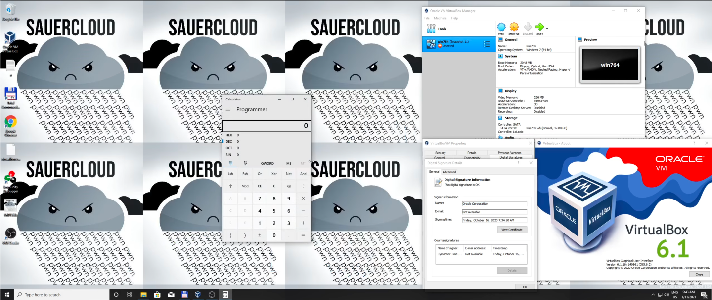

# RWCTF21-VirtualBox-61-escape

0day VirtualBox 6.1 Escape for RealWorld CTF 2020/2021

## Demo 

## What?

This is our solution for RealWorld CTF's "Box Escape" challenge from the 2020/2021 quals. ~~Currently a 0day but we'll add the CVE number once there is one.~~ CVE-2021-2119

## How does it work?

We wrote a blogpost describing the vulnerabilities and our exploit techniques. You can find it [here](https://secret.club/2021/01/14/vbox-escape.html).

## How to protect yourself?

Until the release build of VirtualBox is patched disable SCSI.

## Credits

Writing this exploit was a joint effort of a bunch of people. 

- ESPR's [spq](https://twitter.com/__spq__), [tsuro](https://twitter.com/_tsuro) and [malle](https://twitter.com/fktio) who don't need an introduction :D

- My ALLES! teammates and windows experts Alain Rödel aka [0x4d5a](https://twitter.com/0x4d5aC) and Felipe Custodio Romero aka [localo](https://twitter.com/_localo_)

- [niklasb](https://twitter.com/_niklasb) for his [prior work](https://github.com/niklasb/sploits/tree/master/virtualbox/hgcm-oob/) and for some helpful pointers! 

> "A ROP chain a day keeps the doctor away. Immer dran denken, hat mein Opa immer gesagt."

~ *Niklas Baumstark (2021)*

- myself, Ilias Morad aka [A2nkF](https://twitter.com/A2nkF_) :)

I had the pleasure of working with this group of talented people over the course of multiple sleepless nights and days during and even after the CTF was already over just to get the exploit working properly on a release build of VirtualBox and to improve stability. This truly shows what a small group of dedicated people is able to achieve in an incredibly short period of time if they put their minds to it! I'd like to thank every single one of you :D

